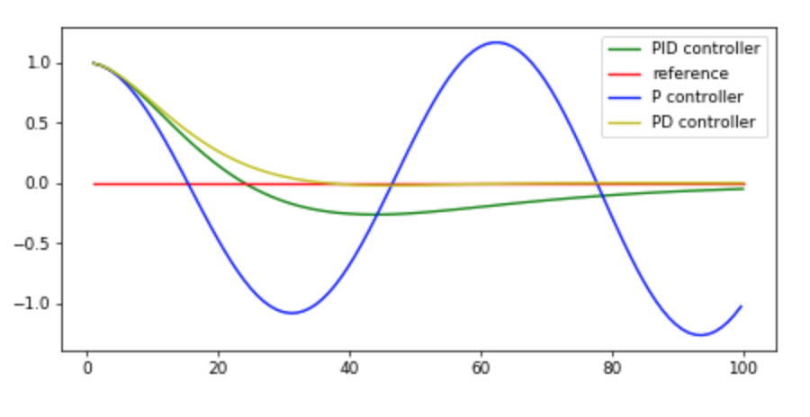
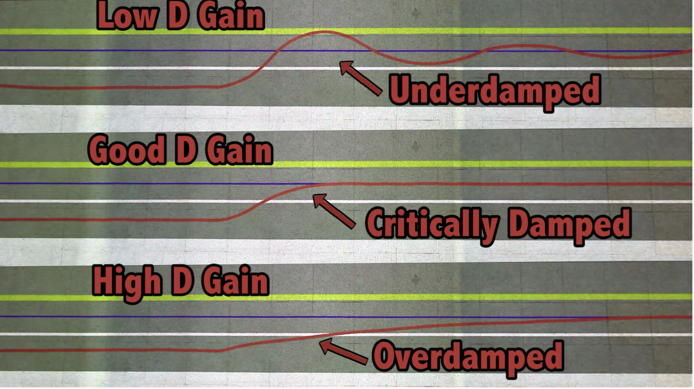

# Reflection
Here I will describe what the effect of the parameters is on the behaviour of the self driving car in the simulation. Then I will describe how I found good values to let the car drive around the track.

## What the parameters P, I, D do

Here is an image from the class that helps understanding what the effect of every parameter is.



Here is the code from the class describing the PID formula.

```
diff_cte = cte - prev_cte
prev_cte = cte
int_cte += cte
steer = -tau_p * cte - tau_d * diff_cte - tau_i * int_cte
```

It may help to take a look at the visualisation and the formula during later explanations.

[This video](https://www.youtube.com/watch?v=4Y7zG48uHRo) explains very well the influence of each parameter in a self driving car setting.

### P Gain
P is proportional to the error. In the simulation the error describes how far away the car is from the middle of the road. The steering angle is between -1 and 1. So if the car is one unit away from the middle of the road and P is 1.0 then the maximum steering angle of -1.0 will be applied. If the car is closer to the middle, a smaller steering angle will be applied. A P gain of 1.0 results in too aggressive steering and the car will start osclillation until it runs off the track. Overall a higher P gain will result in a more aggressive steering, a lower P gain in a more moderate steering. If the P gain is too low, the car will not be able to follow the turns of the road.


### D Gain
D gain will dampen the steering as the derivative of the error is substracted. The derivative simply means the difference between the last error and the current error. So if the car drives towards the middle of the road the error decreases, lets assume from 1.0 to 0.8. The derivative is `0.8 - 1.0 = -0.2`.  Lets assume both P and D are set to 1.0 and I to 0.0, then the resultung steering angle is `- P * 0.8 - D * (-0.2) = -1.0 * 0.8 - (-1.0 * (-0.2)) = -0.6`.  
Would P be 1.0 and D be 0.0 then the steering angle would be `-0.8`. So D restrains the car from moving to quickly to the center of the road. If D is too low, then the car will still oscilate at the middle of the road. This is called underdamping. If it is too high, the car will take a long time to reach the middle of the road. It is overdamped. When D is set to a good value, the car will arrive at the middle of the road quickly, but not oscilate. This is called critically-damped.



### I Gain
The I gain prevents a systematic error. For example imagine the car drives at the exact center of the road but the steering axel is not straight or there is a steady crosswind which results in an offset of the steering angle of 0.01. The PID controller will calculate a steering angle of 0.0 as the car is at the center but as the steering angle is off by 0.01 the car will drive to the right. Now the controller will try to bring the car back to the center of the road, but if it outputs a steering angle of -0.01 the car will go straight. This results in the car driving next to the center of the road. With the I gain, the error produced by continiously driving next to the center of the road is added up and implemented in the equation. This will correct the systematic error. If the I gain is too low, it will take a long time until the controller corrects the systematic error. If the I gain is to high the controller tries to overcorrect which can result in the car oscilating around the center of the road. 


## How the final parameters were chosen

I started off with finding a good P gain value and set the I gain and D gain to zero and the P gain to one. This resulted in the car applying the maximum steering angle too early and oscilating out of controll and off the track. I lowerd the P gain stepwise until the car was still oscilating but not leaving the track. I found a P gain of 0.2 to be a good value.

Then I wanted to prevent the oscilation of the car by increasing the D gain stepwise. I found a D gain of 10.0 to be good value, that prevents oscilation but also allows the car to return to the middle of the road quickly.

I couldn't see that there was any systematic error in the simulation. The only "error" might be that the track is circular and therefor the car drives more on the right side of the road. I tried to set an I gain but found that it must be very low so that the car does not turn out of controll. I found 0.001 to be good value.

I also implemented the Twiddle algorithm as a class encapsulating the PID controller. But the simulation runs in real time and therefore it takes a long time for the algorithm to converge. Manually tuning the parameters proved to be the quicker solution.